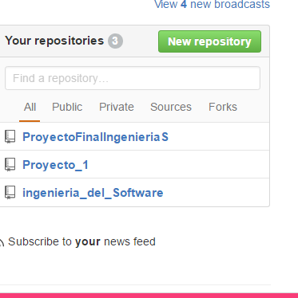
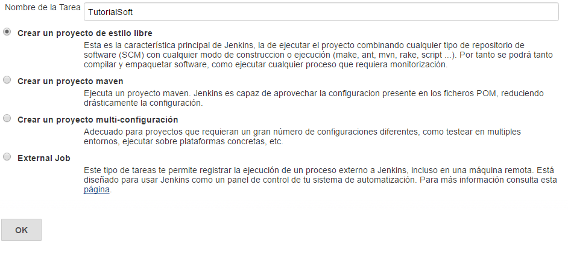
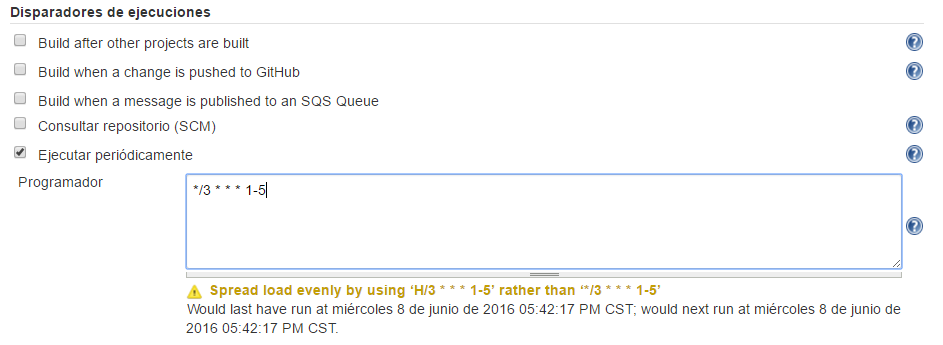

**INTEGRACIÓN CONTINUA: JENKINS, GITHUB, MSBUILD Y VISUAL STUDIO COMMUNITY 2015**

**La integración continua** es una buena práctica de desarrollo de Software. Consiste en que todos los involucrados en el desarrollo de software integren frecuentemente su trabajo y con la compilación y ejecución de pruebas se puedan detectar errores tan rápido como sea posible, y así poder corregirlos. Esta práctica se apoya en el **Versionamiento continúo** en donde solamente se almacena nuestro trabajo llevando una bitácora de los cambios realizado y llevando registro de la anotaciones de cada cambio.

**GitHub:** es un entorno de desarrollo colaborativo para almacenar proyectos de Software en la nube, utiliza el sistema de Versionamiento Git.

**Jenkins:** Es un servidor de integración continua, es de código abierto, Jenkins funciona a base de tareas donde se pueden administrar lo que se hará en un build, como programar cada cuanto tiempo revise nuestro repositorio de Versionamiento o que haga un despliegue a otro servidor, etc.

**Msbuild:** Es una herramienta de construcción de código Microsoft y Visual Studio; Visual Studio depende me Msbuild pero Msbuild no depende de Visual Studio para construir el código.

**Visual Studio Community 2015:** Es la versión más reciente de Visual Studio un completo entorno de desarrollo para crear aplicaciones Windows, iOS y Android así como aplicaciones Web.

**Necesitas:**

Un servidor en donde se instala Jenkins y construirán las soluciones.

Una cuenta en GitHub

Un entorno de desarrollo en este caso Visual Studio

Un servidor de despliegue

**PASOS:**

1.  GITHUB

    1.  Crear una cuenta GitHub llenando los campos necesarios.

> 
>
> [*https://github.com*](https://github.com)

1.  Descargar GitHub for Desktop, nos permite trabajar con GitHub desde nuestro escritorio. No es necesario pero podría ser útil para administrar y crear nuevos repositorios. Se puede descargar desde este enlace, y su instalación es muy sencilla. [*https://desktop.github.com*](https://desktop.github.com)

> 

1.  VISUAL STUDIO COMMUNITY 2015

    1.  Descargar Visual Studio Community 2015 [*https://www.visualstudio.com/en-us/products/vs-2015-product-editions.aspx*](https://www.visualstudio.com/en-us/products/vs-2015-product-editions.aspx)

        1.  Instalar Visual Studio Community 2015, seleccionar las opciones para instalar los complementos de GitHub.

> 

1.  Enlazar Visual Studio con GitHub

    1.  Primero vamos crear un nuevo repositorio en GitHub, el enlace será el mismo donde nos registramos. Ingresamos con nuestros datos y ahí se nos muestra la opción para crear el nuevo repositorio.

> Colocamos el nombre que le queremos dar a nuestro nuevo repositorio, se nos muestran la opciones si queremos que nuestro repositorio sea público o privado; lo dejaremos en público. Copiaremos la dirección que ahí nos aparece porque es la que utilizaremos para que Visual Studio se comunique con GitHub.
>
> 

1.  Abrimos Visual Studio y en la pestaña Team Explorer que ahí nos aparece, en la sección Local Git Repositories seleccionamos la opción Clone y colocamos la dirección del repositorio creado en GitHub. De nuevo damos clic en Clone y luego se nos mostrara un mensaje que nuestro repositorio ha sido clonado con éxito.

1.  Para crear un nuevo proyecto dentro de nuestro repositorio

    1.  Damos doble clic en nuestro repositorio clonado y luego seleccionamos la opción New para crear nuevo proyecto. En este caso seleccione un formulario solo para mostrar. Hacemos clic en ok, y podemos agregar los cambios que queramos.

 

1.  Para enviar los cambios al repositorio en GitHub

    1.  En la pestaña de Team Explorer en la opción Change se mostraran todos los cambios que realicemos en nuestro proyecto.

> 
>
> Se indicara que debemos escribir un comentario antes de poder enviar los cambios al repositorio en GitHub. Puede ser cualquier comentario que indique cuales fueron los cambios realizados. Luego en la pestaña que aparece daremos clic en la opción Commit All and Push.
>
> 
>
> Y se indicara que los cambios fueron enviados con éxito a nuestro repositorio. Y en GitHub se mostrar los cambios enviados.

 

1.  JENKINS

    1.  Descargar Jenkins, en este caso se instalara Jenkins en una Maquinan Virtual con sistema operativo Windows Server 2012, por lo que la versión que seleccionamos la opción de Windows de Jenkins. [*https://jenkins.io*](https://jenkins.io)

> <embed src="./media/image17.emf" width="275" height="201" />

1.  Instalar Jenkins: una vez descargado el archivo se debe descomprimir y ejecutar el asistente de instalación.

> <embed src="./media/image18.emf" width="130" height="43" /> <embed src="./media/image19.emf" width="170" height="134" /> <embed src="./media/image20.emf" width="191" height="147" />

1.  Abrir Jenkins

    1.  Jenkins corre el puerto 8080, en este caso como es un servidor Windows debe de estar habilitado el IIS (Internet Information System). Aquí podrás ver como configurarlo: [*https://msdn.microsoft.com/es-es/library/ms181052(VS.80).aspx*](https://msdn.microsoft.com/es-es/library/ms181052(VS.80).aspx)

    2.  Para acceder a Jenkins solo debemos escribir en cualquier navegador la dirección del IIS en este caso [*http://localhost:8080*](http://localhost:8080)

    3.  Se abrirá una página de Login donde nos pedirá los datos para iniciar sesión o crear un nuevo usuario si aún no tenemos uno.

<embed src="./media/image21.emf" width="303" height="138" />

1.  Configurar Jenkins

    1.  Lo primero será agregar una credencial a Jenkins, esta nos servita para dar permisos a configuraciones posteriores. Ingresamos los datos que se nos piden y damos clic en OK.

> <embed src="./media/image22.emf" width="95" height="122" /><embed src="./media/image23.emf" width="264" height="64" /><embed src="./media/image24.emf" width="343" height="70" />
>
> <embed src="./media/image25.emf" width="343" height="73" />

1.  Luego descargaremos los Plugins necesarios para que se comunique con GitHub. En el panel de control damos clic en Manage Jenkins y seleccionamos Maneje Plugins.

<embed src="./media/image26.emf" width="173" height="35" /> <embed src="./media/image27.emf" width="387" height="37" />

1.  Seleccionamos y descargamos los Plugins, en la pestaña Available encontramos los que están disponibles para la descarga. Seleccionamos cualquier opción para comenzar la descarga e instalación.

> <embed src="./media/image28.emf" width="381" height="193" />

1.  Crear una nueva tarea para construir la solución,

    1.  En el panel principal de Jenkins seleccionamos la opción New Item.

> 

1.  Escribimos el nombre de la tarea y seleccionamos de la opción Crear un proyecto de estilo libre. Y damos clic en OK.

> 

1.  Configurar la nueva tarea para que se comunique con GitHub.

    1.  Colocamos una descripción a la tarea y seleccionamos la opción de GitHub Project en donde colocaremos la URL del repositorio creado en GitHub.

> 

1.  Configuramos el origen del código fuente con los datos con la URL del repositorio de GitHub y la credencial que ya habíamos creado.

1.  Seleccionamos las opciones disparadores de ejecución, marcamos la opción ejecutar periódicamente, en donde agregaremos los parámetros para indicar cada cuanto tiempo revise si existe un cambio y en un lapso de cuantas horas.

> 

1.  Seleccionamos guardar y esperamos que se construya la primera solución.

1.  En el panel principal se muestran las tareas que hemos agregado y el estado en el que se encuentra.

1.  MSBUILD

<!-- -->

1.  Descargar el Plugin de Msbuild desde Jenkins para compilar la aplicación. Seguimos los mismos pasos que utilizamos para descargar los Plugins de GitHub.

> 

1.  Descargar e instalar la herramienta Msbuild en el servidor. [*https://www.microsoft.com/en-us/download/details.aspx?id=48159*](https://www.microsoft.com/en-us/download/details.aspx?id=48159)

> 
>
> 

1.  Configurar Jenkins para que trabajo con Msbuild

    1.  Para que Msbuild compile la solución y funcione corecctamente debemos configurar una variable de entorno con la ruta de instalación.

1.  En la administración de Jenkins, Configurar el sistema seleccionamos la opcion Añadir MsBuild y llenamos los campos requeridos conun nombre y la ruta donde se instalo la herramienta de Msbuild.

1.  Configuramos la tarea que creamos para que construya la solución de nuestra aplicación. Dando clic en la opción añadir un nuevo paso y luego en contruir un Visual Studio Project o una solución usando Msbuild, agregamos los datos que se nos indica. Guardamos los cambios.

> 
>
> 

1.  Damos clic en Construir ahora para que se compile y genere el ejecutable de nuestra aplicación.

>  

1.  El ejecutable de nuestra aplicación se guardara en la siguiente ruta:

C:\\Program Files (x86)\\Jenkins\\jobs\\TutorialSoft\\workspace\\Tutorial\_Form\\Tutorial\_Form\\bin\\Debug

1.  DESPLIEGUE

    1.  En la configuración de Jenkins vamos a descargar los plugins necesarios para poder hacer el despliegue de la aplicación.

> 

1.  En la configuración nuestra tarea vamos a añadir una acción para ejecutar después, seleccionamos la opción Publicar artefacto en FTP.

> 

1.  Ingresamos los datos del servidor FTP, guardamos los cambios y cada vez que realicemos un cambio nuestra aplicación se desplegara en el servidor, según lo configurado.

> 
